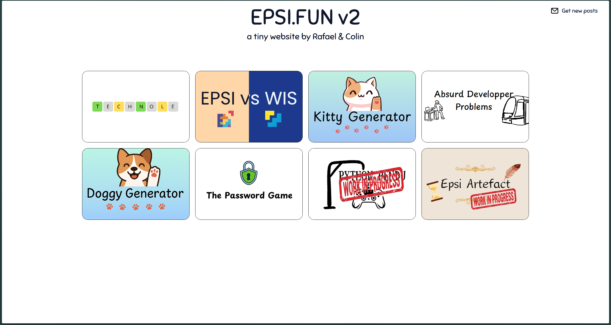

# Index documentation
---
[(Revenir à la page d'accueil)](../README.md)

Bienvenue sur la documentation de EPSI.FUN V2 ! Ce document vous guidera à travers les différentes sections et fonctionnalités du site, afin que vous puissiez comprendre ses spécificités.

## Introduction

L'index est la page d'accueil de l'application. Il contient une grille avec l'ensemble des jeux présent sur EPSI.FUN.

### Responsivité

La page d'accueil est responsive, ce qui signifie qu'elle s'adapte à la taille de l'écran de l'utilisateur. Sur mobile, la grille est affichée en une seule colonne, tandis que sur les écrans plus larges, elle s'affiche en plusieurs colonnes.
